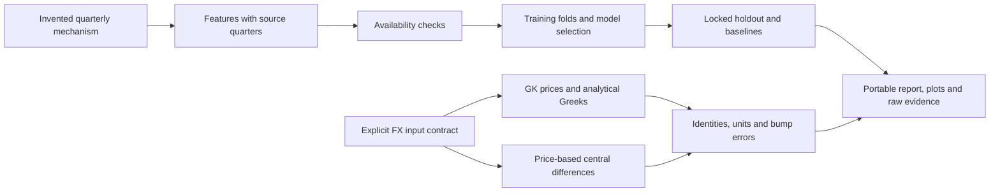

# Architecture

The two numerical experiments are independent. They meet only in the report generator.
Neither imports an earlier portfolio prototype or reads files from another repository.

- `fx.py` owns input units, European option prices and mathematical sensitivity checks.
- `credit.py` owns synthetic data generation, causal features, training and holdout evaluation.
- `report.py` owns file generation and presentation. A report cannot confer model approval.
- `tests/` exercises constraints through perturbed inputs, identities and independent price evaluations.
- `docs/sample/` is a committed illustrative run, not a second implementation or a reference market dataset.

Runtime has no network or credential integration. Generated files default to ignored `outputs/`.
To update the committed example, regenerate from the documented seed and review every changed file.
The manifest records source hashes, input hash and installed numerical-library versions.
Generation requires a new output path, builds in a temporary sibling directory, and publishes
the completed directory in one rename. It never refreshes an existing report in place.
`checksums.json` covers every evidence file (excluding itself); `--verify` checks both inventory
and bytes, so a stale chart or incomplete copied bundle is detectable.
Hashes allow reproduction checks; they do not certify correctness or prove a dataset's ownership.
