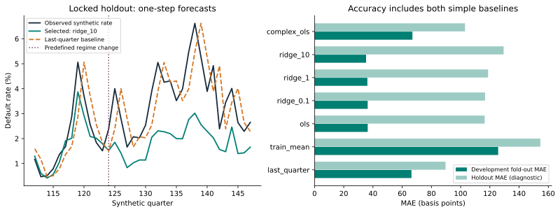
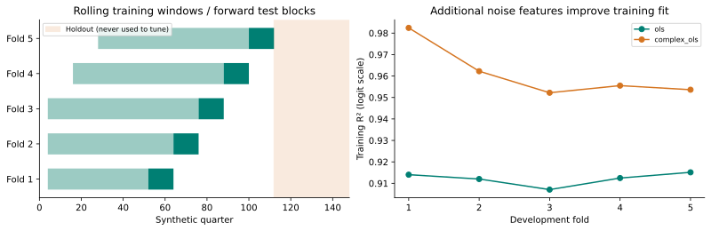
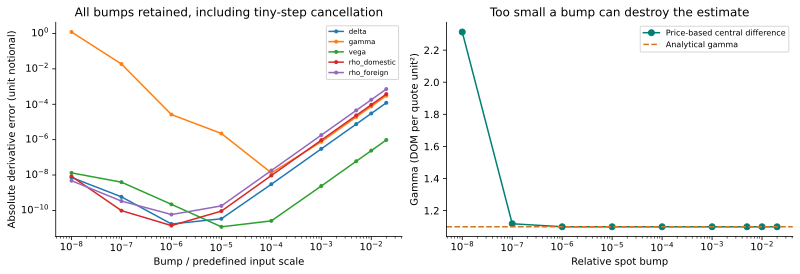

# Validation report — seed 20260907

Generated by Model Risk Lab 0.1.0. All observations and option scenarios are invented.
Reproduce with `model-risk-lab --seed 20260907 --output outputs/reproduction`.
Credit inputs are in [synthetic_quarters.csv](synthetic_quarters.csv). The generating mechanism is
documented in the repository's credit method note. Fold metrics, FX scenario parameters, versions
and code hashes are in [results.json](results.json).

## Credit regression

**ridge_10** was selected using development fold-out MAE only. Its holdout MAE is
**129.43 bp**, higher than the last-quarter baseline's **89.67 bp**.
This is one synthetic experiment, not evidence of predictive skill on a real portfolio.

| Model | Development MAE (bp) | Holdout MAE (bp) | Holdout bias (bp) |
|:--|--:|--:|--:|
| last_quarter | 66.35 | 89.67 | -2.94 |
| train_mean | 125.69 | 154.57 | -126.12 |
| ols | 36.40 | 116.46 | -109.36 |
| ridge_0.1 | 36.38 | 116.72 | -109.66 |
| ridge_1 | 36.17 | 118.80 | -112.07 |
| ridge_10 **selected** | 35.29 | 129.43 | -124.15 |
| complex_ols | 67.01 | 103.02 | -73.52 |

Holdout scores for unselected candidates are diagnostic; they do not change the selected model.
Quarterly information is updated through each test block; coefficients stay fixed in the block.
This is not a multi-quarter forecast made at a single origin. The holdout includes a predefined
mechanism change at quarter 124. Bias means prediction minus observation.

The deliberately invalid current-target feature obtained mean fold MAE
**0.4803 bp**. Its information-availability check rejected it:
**True**. It is excluded from selection. A good-looking
score cannot repair invalid information timing. The small remaining error reflects the smoothed
target transformation, not a deployable prediction.

## FX sensitivities

The experiment retains **270** estimates: three synthetic scenarios, call and put,
five Greeks, and nine predetermined bump sizes. Full price-up/base/down values and errors
are in [fx_bumps.csv](fx_bumps.csv); scenario inputs are in [results.json](results.json).

At the predeclared relative bump 1e-4, maximum absolute errors over the six case/payoff combinations
are shown separately for each raw derivative, at unit foreign notional. Their units differ;
use the method note's unit table when interpreting them. No bump is selected after inspecting results.

| Greek | Max absolute error at relative bump 1e-4 |
|:--|--:|
| delta | 2.17e-08 |
| gamma | 3.11e-07 |
| vega | 4.57e-10 |
| rho_domestic | 1.61e-08 |
| rho_foreign | 1.81e-08 |

Analytical agreement checks implementation consistency under a flat-volatility model. It does
not validate market calibration or economic suitability. Unit contracts, mathematical identities,
and finite differences address different failure modes.

## Evidence and next experiment

- [Synthetic input CSV](synthetic_quarters.csv), [holdout predictions](credit_predictions.csv),
  [full result and provenance](results.json), [all FX differences](fx_bumps.csv).
- Use a new seed to test whether conclusions survive another invented path; do not select seeds for a flattering result.
- Next credit extension: publish-delay assumptions with revised vs first-release data semantics.
- Next FX extension: independently test tail stability and numerical pricing with convergence bounds.
- Educational scope: no real customer data, regulatory approval, production use or full ECL/SIMM implementation.
